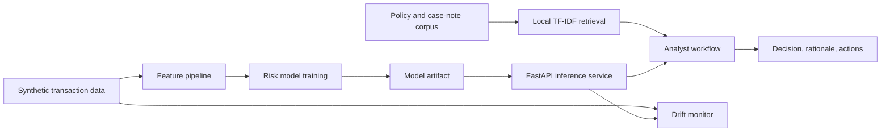

# Sentinel AI Risk Platform

Production-oriented machine learning and AI reference project for real-time risk scoring, explainable decisions, lightweight retrieval-augmented analysis, and drift monitoring.

Built on May 18, 2026 with a modern Python stack: FastAPI, Pydantic v2 settings, scikit-learn pipelines, Typer CLI, pytest, Docker, and GitHub Actions.

## What This Project Demonstrates

- End-to-end supervised ML workflow for synthetic transaction risk scoring.
- Reproducible data generation, model training, evaluation, and artifact export.
- FastAPI service with health, prediction, explanation, retrieval, and analyst-agent endpoints.
- Local retrieval system based on TF-IDF vectors for policy and case-note grounding.
- Rule-aware AI workflow that combines model probability, retrieved context, and operational actions.
- Drift monitoring using Population Stability Index and feature-level summaries.
- Professional repository hygiene: tests, CI, Docker, Makefile, model card, data card, architecture notes, and typed Python package layout.

## Architecture



## Quickstart

```bash
python -m venv .venv
source .venv/bin/activate  # Windows: .venv\Scripts\activate
pip install -e ".[dev]"
make bootstrap
make test
make run-api
```

Open `http://localhost:8000/docs` after the API starts.

## CLI

```bash
sentinel generate-data --rows 5000
sentinel train
sentinel evaluate
sentinel drift-report
sentinel serve
```

## Validation

```bash
pytest
ruff check .
mypy src
```

## Notes

This repository is intentionally self-contained. It does not require paid APIs or external model providers to run locally. The deterministic analyst workflow is auditable by default, while the code structure leaves clear extension points for LLM providers, vector databases, and model registries.
